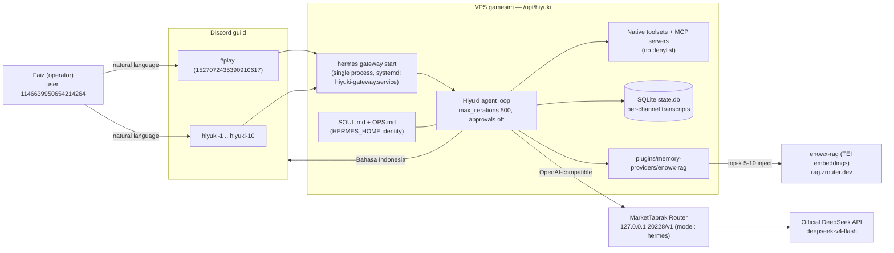

# Hiyuki

[](https://github.com/fazulfi/hiyuki-agent/actions/workflows/ci.yml)
[](https://www.python.org/)
[](https://github.com/NousResearch/hermes-agent)
[](LICENSE)
[](https://docs.astral.sh/ruff/)
[](CONTRIBUTING.md)

**Hiyuki** is a single-agent, zero-restriction deployment of
[NousResearch/hermes-agent](https://github.com/NousResearch/hermes-agent) —
one gateway process, one operator, natural-language Discord chat in Bahasa
Indonesia, long-term memory via a remote RAG backend, and no artificial tool
restrictions. This repository holds the configuration, persona, governance, and
deployment surface; the Hermes runtime itself is a separately pinned git
dependency, installed from its own checkout.

---

## Contents

- [Architecture](#architecture)
- [Design principles](#design-principles)
- [Quickstart](#quickstart)
- [Installation](#installation)
- [Configuration](#configuration)
- [Security model](#security-model)
- [Deployment](#deployment)
- [Operations runbooks](#operations-runbooks)
- [Roadmap](#roadmap)
- [Support and contact](#support-and-contact)
- [License](#license)

## Architecture

Hiyuki runs as a single `hermes gateway start` process on a dedicated VPS. Chat
arrives over Discord, the agent loop calls tools unrestricted, memory is
retrieved from a remote RAG service, and all session state lives in a native
SQLite database. There is no Postgres, no Redis, no Alembic, and no container.



## Design principles

| Principle | Implementation |
|---|---|
| Vanilla upstream | No fork, no monkey-patching; Hermes is a pinned git dependency (~0.21.0, exact SHA pinned at install) |
| Zero restrictions | No `command_allowlist`, no `denylist`, no `tool_policy`; all native toolsets and MCP servers enabled; approvals off |
| Operator-only | The Discord allowlist contains exactly one user: `1146639950654214264` |
| Single process | One gateway (`hermes gateway start`) serves the whole Discord surface; natural language only, no slash commands |
| Minimal data plane | Native SQLite `state.db` for transcripts and sessions; remote RAG for long-term memory; nothing else |
| Honest memory | Persona and operational contract live in `SOUL.md` and `OPS.md` under `HERMES_HOME`, loaded verbatim at startup |

## Quickstart

Prerequisites: Python 3.11–3.13, [uv](https://docs.astral.sh/uv/), git, and a
Discord bot token with the Message Content intent enabled.

```bash
# 1. Clone this repository
git clone https://github.com/fazulfi/hiyuki-agent.git
cd hiyuki-agent

# 2. Install the pinned Hermes runtime (clones upstream separately)
make install

# 3. Provide secrets via SOPS/age
export HERMES_HOME=/home/gamesim/.hermes-hiyuki   # local dev: any empty dir
sops --encrypt --in-place "$HERMES_HOME/.env"     # produces .env.sops

# 4. Place the gateway profile and persona into HERMES_HOME
cp config/config.yaml "$HERMES_HOME/config.yaml"

# 5. Run the gateway (single process)
hermes gateway start
```

## Installation

The Hermes runtime is intentionally installed from its own checkout, not as a
dependency of this repository.

```bash
# Clone upstream, pinned to ~0.21.0 (exact commit SHA fixed at install time)
git clone --branch v0.21.0 https://github.com/NousResearch/hermes-agent.git ../hermes-agent

# Create the virtualenv OUTSIDE the hermes source tree
uv venv .venv

# Install with the messaging (discord.py 2.7.1) and mcp (mcp 2.0.0) extras
cd ../hermes-agent
uv pip install -e ".[messaging,mcp]"
```

Python constraint: `>=3.11,<3.14`. The venv must live outside the Hermes
checkout so the agent's own filesystem tools cannot delete its running
interpreter.

The local plugin at `plugins/memory-providers/enowx-rag` is installed into the
same venv as an editable package, wiring the remote RAG backend into Hermes'
native memory-provider interface.

## Configuration

All runtime behavior is declared in [`config/config.yaml`](config/config.yaml)
and resolved against environment variables sourced from `.env.sops`. Secrets are
never written inline; the profile references them as `${ENV_VAR}`.

| Section | Key | Value | Notes |
|---|---|---|---|
| `model` | `base_url` | `http://127.0.0.1:20228/v1` | MarketTabrak Router (same VPS, loopback) |
| `model` | `model` | `hermes` | Router alias for `deepseek-v4-flash` |
| `model` | `context_length` | `1000000` | Maximum supported by the backend |
| `model` | `max_tokens` | `128000` | Maximum output tokens |
| `model` | `temperature` | `1.0` | Backend-recommended sampling |
| `model` | `api_key` | `${HIYUKI_MARKETTABRAK_API_KEY}` | Sourced from `.env.sops` |
| `agent` | `name` | `Hiyuki` | Single agent |
| `agent` | `max_iterations` | `500` | High ceiling for long tool loops |
| `agent` | `approvals.mode` | `false` | Zero-approval operation |
| `discord` | `token` | `${DISCORD_BOT_TOKEN}` | Single bot, reused |
| `discord` | `require_mention` | `false` | Message Content intent required |
| `discord` | `allowed_users` | `['1146639950654214264']` | Operator-only allowlist |
| `discord` | `channels` | 11 IDs | `#play` + `hiyuki-1..10`, NL only, no slash commands |
| `discord` | `text_batch_delay` | `0.6` | Long-message batching |
| `discord` | `split_delay` | `0.1` | Auto-split cadence |
| `discord` | `history_backfill` | `true` | Resume context on restart |

## Security model

- **Operator-only surface.** The Discord allowlist admits exactly one user.
  `require_mention: false` requires the privileged Message Content intent but
  remains private to that operator.
- **SOPS/age secrets.** All credentials (`DISCORD_BOT_TOKEN`,
  `HIYUKI_MARKETTABRAK_API_KEY`, and channel/guild identifiers) live in an
  encrypted `.env.sops` decrypted at runtime; the age key resides at
  `/etc/gamesim/age.key` (mode `600`) on the VPS. Plaintext secrets are
  git-ignored and never committed.
- **Loopback LLM routing.** The router endpoint is `127.0.0.1` on the same VPS;
  no inference traffic leaves the host unencrypted.
- **Accepted-risk autonomy.** The agent runs with unrestricted local access by
  explicit operator decision. This is a documented property of the design — see
  [SECURITY.md](SECURITY.md) for the full threat model.

## Deployment

| Aspect | Value |
|---|---|
| VPS path | `/opt/hiyuki` |
| Hermes home | `HERMES_HOME=/home/gamesim/.hermes-hiyuki` |
| Service | `hiyuki-gateway.service` (systemd, single unit) |
| Entrypoint | `hermes gateway start` |
| Method | Tarball archive, atomic switch; not Dockerized |

```bash
# On the VPS
sudo systemctl enable --now hiyuki-gateway.service
journalctl -u hiyuki-gateway.service -f
```

## Operations runbooks

| Runbook | Purpose |
|---|---|
| [docs/ops/](docs/ops/) | Installation, upgrade, rollback, and backup procedures |
| [OPS.md](OPS.md) | Agent operational contract (capabilities) |
| [AGENTS.md](AGENTS.md) | Coding-agent contract for work on this repository |
| [docs/decisions.md](docs/decisions.md) | Decision log (source of truth for design) |

## Roadmap

| Phase | Scope | Status |
|---|---|---|
| F0 | Preparation and final backups | Done |
| F1 | Repository scaffold (this tree) | Done |
| F2 | SOUL and OPS rewrite | In progress |
| F3 | Config and secrets (`config.yaml`, `.env.sops`, MCP fleet) | Planned |
| F4 | Teardown of the legacy deployment | Planned |
| F5 | Fresh state (SQLite only, no DB server) | Planned |
| F6 | Hermes install, commit-pinned | Planned |
| F7 | systemd deploy (`hiyuki-gateway.service`) | Planned |
| F8 | Verification (tool-calling, RAG, acceptance gates) | Planned |

## Support and contact

- Repository owner: [@fazulfi](https://github.com/fazulfi) (Faizul Fadhly)
- Bugs and features: [open an issue](https://github.com/fazulfi/hiyuki-agent/issues)
- Vulnerabilities: follow the responsible-disclosure process in
  [SECURITY.md](SECURITY.md) — do not open a public issue
- Contributing: see [CONTRIBUTING.md](CONTRIBUTING.md)

## License

Released under the [BSD-3-Clause License](LICENSE), copyright 2026 Faizul Fadhly.